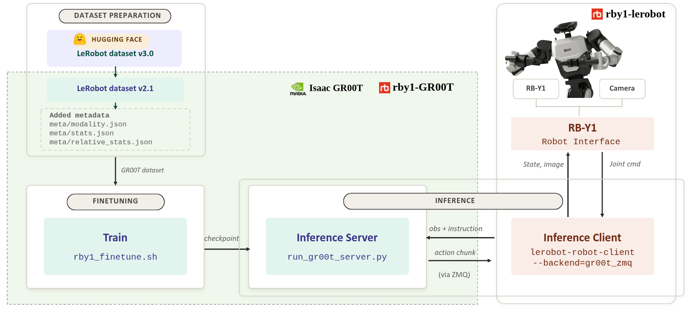

# Finetuning [RB-Y1](https://www.rainbow-robotics.com/en_rby1) Model

This guide shows how to finetune dataset collected from RB-Y1 robot, and evaluate the model on the real robot.

## Overview


## (1-A) Dataset

To collect the dataset via teleoperation, please refer to the official documentation in [rby1-lerobot](https://github.com/RainbowRobotics/rby1-lerobot)

**Dataset Path:** [rainbowrobotics/icra_0526](https://huggingface.co/datasets/rainbowrobotics/icra_0526) : Total data size = 32 GB (combined v2 + v3 datasets)

Visualize it with this [link](https://huggingface.co/spaces/lerobot/visualize_dataset?path=%2Frainbowrobotics%2Ficra_0526_recomputed_stats%2Fepisode_0)

## (1-B) Handling the dataset

```bash
uv run --project scripts/lerobot_conversion \
  python scripts/lerobot_conversion/convert_v3_to_v2.py \
  --repo-id rainbowrobotics/icra_0526 \
  --root dataset
```

Then move the `modality.json` file into the dataset's `meta/` directory.
```bash
cp rby1/modality.json dataset/rainbowrobotics/icra_0526/meta/modality.json
```

## (1-C) Dataset Statistics

Generate the statistics file expected by GR00T:

In case of absolute joint positions:
```bash
uv run python gr00t/data/stats.py \
  --dataset-path dataset/rainbowrobotics/icra_0526 \
  --embodiment-tag NEW_EMBODIMENT \
  --modality-config-path rby1/rby1m_config.py

```

## (2) Finetuning

Run the shared finetune launcher directly, using absolute joint positions:
```bash

USE_WANDB=0 CUDA_VISIBLE_DEVICES=0 NUM_GPUS=1 uv run bash rby1/rby1_finetune.sh \
  --base-model-path nvidia/GR00T-N1.7-3B \
  --dataset-path dataset/rainbowrobotics/icra_0526 \
  --modality-config-path rby1/rby1m_config.py \
  --embodiment-tag NEW_EMBODIMENT \
  --shortest-image-edge 256 \
  --crop-fraction 0.95 \
  --output-dir outputs/rby1/test


USE_WANDB=0 CUDA_VISIBLE_DEVICES=0,1,2,3,4,5,6,7 NUM_GPUS=8 uv run bash rby1/rby1_finetune.sh \
  --base-model-path nvidia/GR00T-N1.7-3B \
  --dataset-path dataset/rainbowrobotics/icra_0526 \
  --modality-config-path rby1/rby1m_config.py \
  --embodiment-tag NEW_EMBODIMENT \
  --shortest-image-edge 256 \
  --crop-fraction 0.95 \
  --output-dir outputs/rby1/test

```

You can also experiment with relative positions:
In this case, generate the relative statistic file at meta directory using the relative config option:
--modality-config-path rby1/rby1m_config_relative.py
, and then run the finetuning launcher using the relative config option:
--modality-config-path rby1/rby1m_config_relative.py

## (3) Offline Evaluation for GR00T model checkpoint

Evaluate the finetuned model with the following command:
```bash

uv run python gr00t/eval/open_loop_eval.py \
  --dataset-path dataset/rainbowrobotics/icra_0526 \
  --embodiment-tag NEW_EMBODIMENT \
  --model-path outputs/rby1/test/checkpoint-10000 \
  --traj-ids 0 \
  --action-horizon 40 \
  --steps 400 \
  --save-plot-path outputs/rby1/test/checkpoint_10k

```

### Evaluation Results

The evaluation produces visualizations comparing predicted actions against ground truth trajectories.
To read the numbers in the evaluation result and decide whether your fine-tune is working, see [Interpreting the Result: Is My Fine-tune Working?](../../getting_started/finetune_new_embodiment.md#interpreting-the-result-is-my-fine-tune-working).

## (4) Real-Robot GR00T Policy Evaluation

This setup assumes the inference server and the User PC (UPC) are on the **same local network** (e.g., the same lab LAN or router). The policy server runs on a GPU machine, and the inference client runs on the UPC attached to the robot, communicating over the GR00T-ZMQ backend. 
The UPC's inference client code uses the customized async-inference implementation from the `rby1-lerobot` repository, described in Step 2 below.

1. Start the policy server (ZMQ) on the inference server (e.g., a server PC with an RTX-5090 GPU),
   run from the repository root:
```bash
uv run python gr00t/eval/run_gr00t_server.py \
  --host 0.0.0.0 --port 5555 \
  --model-path outputs/rby1/test/checkpoint-10000
```   
   > **Note:** `0.0.0.0` is not a real address; it's a *bind setting* meaning "the server accepts
   > connections on all of its network interfaces."
   >
   > `--embodiment-tag` is omitted here since it defaults to `NEW_EMBODIMENT`


2. Set up the client (e.g., a User PC (UPC) mounted on the RB-Y1 backpack):

   For instructions on running the RB-Y1 inference client with GR00T-ZMQ backend support,
   see the customized async-inference implementation in
   [RainbowRobotics/rby1-lerobot](https://github.com/RainbowRobotics/rby1-lerobot/tree/feat/async_inference/lerobot-async-rby1)
   (`feat/async_inference` branch, `lerobot-async-rby1` directory).

```bash
   git clone --branch feat/async_inference https://github.com/RainbowRobotics/rby1-lerobot.git
   cd rby1-lerobot/lerobot-async-rby1
   pip install -e .
```

3. Run the eval script as the client, using the package installed above:

```bash
lerobot-robot-client --backend=groot_zmq --robot.type=rby1 --server_address=127.0.0.1:5555 \
  --robot.cameras='{"front": {"type": "realsense", "serial_number_or_name": "XXXXXXXXX", "fps": 30, "width": 640, "height": 480},"right": {"type": "realsense", "serial_number_or_name": "XXXXXXXXX", "fps": 30, "width": 480, "height": 640, "rotation": Cv2Rotation.ROTATE_90 }, "left": {"type": "realsense", "serial_number_or_name": "XXXXXXXXX", "fps": 30, "width": 480, "height": 640, "rotation": Cv2Rotation.ROTATE_90 }}'\
  --task="Put the can into the green bin and the plastic bottle into the gray bin" \
  --actions_per_chunk=40 \
  --chunk_size_threshold=0.7 --debug_visualize_queue_size=True \
  --robot.type=rby1 --fps=30  
```  
   > **Note:** `127.0.0.1:5555` is a placeholder. Replace it with the **actual IP address of
   > the inference server** — do **not** use `0.0.0.0` from the server's startup log.
   >
   > To find that IP, run this **on the inference server**:
   > ```bash
   > hostname -I
   > ```
   > Then combine it with the port from Step 1, e.g. `--server_address=192.168.1.42:5555`.
   >
   > You should properly set the camera config with sutiable rotation option for the corresponding dataset
   > when you use lerobot-robot-client